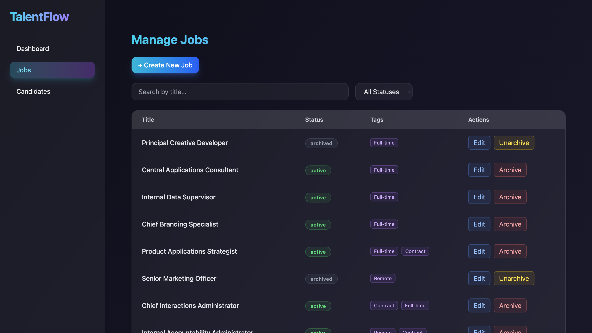
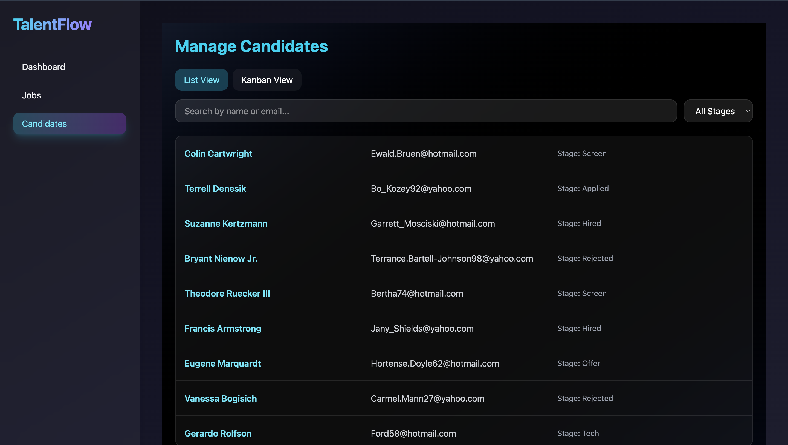
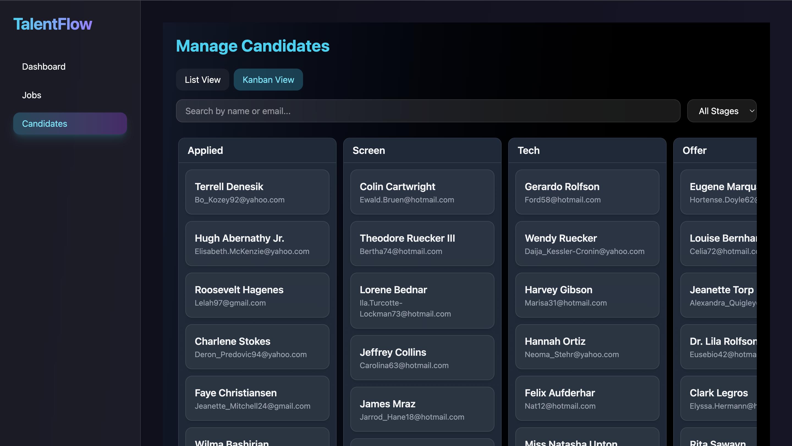

# TALENTFLOW - A Mini Hiring Platform

A comprehensive front-end single-page application (SPA) built with React that simulates an interactive hiring platform for an HR team. This project features robust state management, a mock API layer, and a rich user interface for managing jobs, candidates, and assessments. All data persists locally in your browser.

---

## LIVE DEMO LINK 
[Live Link](https://talentflow-pankajyadav2943.onrender.com/)






---

## Features ✨

### Job Management
* **CRUD Operations**: Create, read, update, and archive job postings in a clean modal interface.
* **Advanced Filtering**: A jobs board with server-like filtering for title and status.
* **Drag & Drop Reordering**: Easily reorder the priority of job listings with a smooth drag-and-drop interface.
* **Optimistic Updates**: Reordering is instant. The UI updates immediately and seamlessly rolls back if the "API" call fails, providing a superior user experience.
* **Deep Linking**: Each job has a unique, shareable URL (`/jobs/:jobId`).

### Candidate Management
* **High-Performance List**: A virtualized list renders over 1,000 seeded candidates with no performance degradation, including client-side search and filtering.
* **Kanban Board**: A drag-and-drop Kanban board to visually track and move candidates through the hiring pipeline (Applied, Screen, Tech, Offer, etc.).
* **Candidate Profiles**: Each candidate has a detailed profile page (`/candidates/:id`) showing their information and a complete timeline of their status changes.
* **Notes with @mentions**: Attach notes to a candidate's profile with real-time @mention highlighting and suggestions from a local list.

### Assessment Platform
* **Dynamic Assessment Builder**: A powerful, per-job form builder to create custom assessments for candidates.
* **Multiple Question Types**: Supports various question formats, including short/long text, numeric, single/multi-choice, and file uploads.
* **Live Preview**: A side-by-side live preview pane that renders the form exactly as the candidate will see it, updating in real-time as you build.
* **Advanced Logic**: The form runtime enforces complex validation rules (e.g., required fields, numeric ranges) and supports conditional questions (e.g., show Question 3 only if Question 1's answer is "Yes").

---

## Tech Stack 🛠️

* **Framework**: React 18 with Vite
* **Language**: TypeScript
* **API Mocking**: Mock Service Worker (MSW)
* **Local Persistence**: IndexedDB via Dexie.js
* **Data Fetching & State Management**: TanStack Query (React Query)
* **Routing**: React Router
* **Drag & Drop**: dnd-kit
* **Form Management**: React Hook Form
* **Virtualized Lists**: TanStack Virtual

---

## Architecture & Technical Decisions

This project was designed to simulate a real-world front-end application that interacts with an API, but without requiring a live backend.

### API Layer (MSW)
Mock Service Worker was chosen to intercept network requests at the service worker level. This creates a highly realistic mock API that is completely decoupled from the application's components. We also implemented artificial latency and random error rates on write endpoints to test optimistic updates, loading states, and error handling thoroughly.

### State Management (TanStack Query)
For all "server" state (jobs, candidates, etc.), TanStack Query was the ideal choice. It handles all caching, background refetching, and stale-data management automatically. Its powerful `useMutation` hook was essential for implementing the optimistic updates with rollback on failure for the job reordering and Kanban board features.

### Local Persistence (Dexie.js)
A core requirement was that all data should persist on browser refresh. IndexedDB was the perfect tool for this, and Dexie.js provided a user-friendly, promise-based wrapper that made database interactions clean and simple. MSW handlers write through to the Dexie database, creating a complete, self-contained application.

---

## Project Setup

To run this project locally, follow these steps:

1.  **Clone the repository:**
    ```bash
    git clone https://github.com/pankajyadav22-26/ENTNT.git
    cd talentflow
    ```

2.  **Install dependencies:**
    ```bash
    npm install
    ```

3.  **Run the development server:**
    ```bash
    npm run dev
    ```

The application will be available at `http://localhost:5173`. The database will be automatically seeded with mock data on the first run.

---

## Known Issues & Future Improvements

* The Assessment Builder's UI for creating options for single-choice and multi-choice questions was stubbed out but could be fully implemented with another `useFieldArray`.
* Notes on the candidate profile are currently stored in local React state and do not persist, as per the original specification ("just render"). This could be extended to save notes to the database.
* A UI for viewing a candidate's submitted assessment responses could be added to the Candidate Profile page.

---